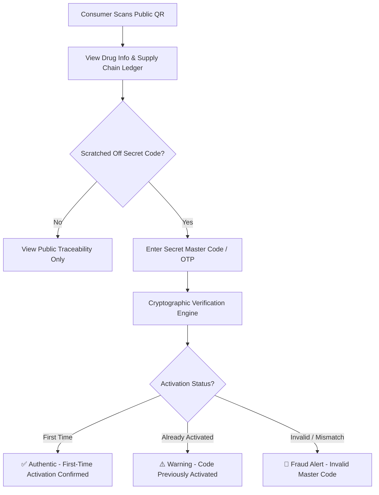
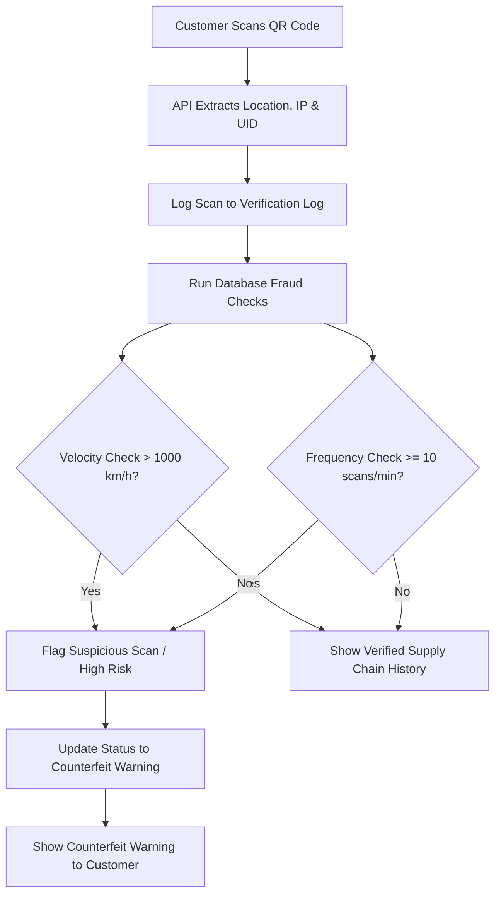
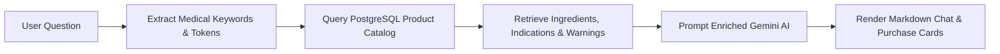

# 💊 PharmaTrace VN

<div align="center">
  
  <h3>An Integrated Pharmaceutical Supply Chain Transparency, WMS, and E-Commerce Platform</h3>
  <p><strong>An integrated Web, API, and Database system orchestrated via Docker.</strong></p>

  
  
  
  
  
</div>

---

## 🎯 Project Vision

**PharmaTrace VN** is a modern pharmaceutical management platform built to address critical challenges in medicine sales and distribution: **counterfeit drug prevention, end-to-end supply chain transparency, dual-code cryptographic authentication, and automated multi-batch warehouse logistics**.

By tracking medicine packages at the unit-level with unique QR codes, cryptographic master codes, and immutable custody ledgers, the platform provides end-to-end transparency from the manufacturing plant to the consumer's hands.

---

## 🏗️ System Architecture

The project brings together the frontend web client, backend REST API, and database orchestration services:

```text
pharma-trace-vn-fullstack/
├── database/                   # Database schemas, stored procedures, triggers, and seed data
│   └── init.sql                # Full database SQL dump
├── pharmatrace-vn-backend/     # Node.js / Express 5 RESTful API & Cryptography Engine
├── pharmatrace-vn-frontend/    # React 18 / Vite Web Client (E-Commerce, Admin, Warehouse, Trace)
├── docker-compose.yml          # Container orchestration (Web, API, DB, Nginx Gateway)
└── .gitattributes              # Git metadata configuration
```

---

## 🔍 Core Engineering Highlights

### 1. Dual-Code Architecture & Cryptographic Verification
PharmaTrace VN employs a robust **Dual-Code Anti-Counterfeiting Architecture**:

*   **Public QR Code:** Printed on outer packaging. Anyone can scan to inspect product details, active ingredients, batch/lot numbers, manufacturing dates, expiration dates, and the full distribution journey.
*   **Secret Master Code / Scratch OTP:** Hidden beneath a scratch-off layer on the inner package. When the customer opens the box and enters the Secret Code, the system performs cryptographic verification via `qrCrypto.js` (HMAC/AES) and permanently activates the product state to **"Authentic — First-Time Verification"**.
*   **Anti-Cloning & Duplicate Activation Defense:** Subsequent entries of an activated secret code immediately trigger a warning indicating the medicine has already been registered, displaying the original activation timestamp and location to protect buyers against cloned counterfeit packaging.



---

### 2. Real-Time Fraud & Anomaly Detection Engine
Whenever a verification scan occurs, the database layer calculates real-time risk profiles:

*   **Velocity Anomaly Detection (Anti-Cloning Check):** Calculates physical distance between consecutive scan locations using the **Haversine formula** with SQL `LAG()` window functions. If the calculated physical speed between scans exceeds **1000 km/h**, it flags a geographic anomaly (proving the physical code was duplicated and scanned in different regions simultaneously).
*   **Scan Frequency Anomaly (DDoS & Scraping Check):** Uses SQL window frames (`COUNT(*) OVER (ORDER BY thoi_gian_quet RANGE BETWEEN INTERVAL '1 minute' PRECEDING AND CURRENT ROW)`) to find scan velocity spikes ($\ge 10$ scans/min).
*   **Immutable Distribution Ledger:** Records every custody transfer in the distribution history (*Manufactured ➔ Warehouse Inbound ➔ Inter-Warehouse Transfer ➔ Pharmacy ➔ Dispensed to Customer*).



---

### 3. Purchase Order (PO) & Multi-Batch Transfer Logistics
The platform integrates an end-to-end **Procurement & Transfer Engine**:

*   **Role-Based PO Creation (`/admin/procurement` & `/warehouse/procurement`):** Pharmacies and Warehouses can create Purchase Orders from verified Pharmaceutical Manufacturers and Distributors. Smart validation prevents units from selecting themselves as suppliers.
*   **Multi-Batch Shipment Synchronization:** Suppliers can fulfill a single PO in multiple partial shipments (Batch 1, Batch 2, etc.). The system dynamically calculates in-transit quantities, tracks remaining items needed, and hides completed orders automatically.
*   **Atomic PostgreSQL Transfer Transactions (`sp_luan_chuyen_kho`):** Stock transfers execute under strict database transactions and row-level locks, ensuring QR tracking codes transition safely to inventory upon inbound confirmation without duplicate execution errors.

---

### 4. Retrieval-Augmented Generation (RAG) AI Chatbot
The system features an intelligent pharmaceutical assistant powered by **Google Gemini** implementing a custom **RAG (Retrieval-Augmented Generation)** architecture to prevent AI hallucinations:

*   **Vietnamese NLP Pre-processing:** Filters stop words and extracts medical bigrams (e.g., "headache", "anemia", "fever").
*   **Database Knowledge Retrieval:** Queries PostgreSQL product catalog to fetch ingredients, indications, dosages, contraindications, and warnings.
*   **Prompt Augmentation:** Structures the drug details into markdown context so Gemini only recommends verified medications available in inventory.
*   **Interactive Purchase Cards:** Returns natural language advice alongside structured product payload cards for instant cart addition.



---

## 🛍️ Portal Ecosystem

The platform provides four specialized portals tailored to different stakeholder workflows:

### 1. Customer E-Commerce Portal — `/`
*   **Browsing & Search:** High-performance catalog with fuzzy search, dynamic filters, brand/category hierarchies, and pagination.
*   **Prescription Upload:** Seamless upload and management of doctor prescriptions for Rx-regulated medications.
*   **Shopping & Checkout:** Cart persistence, voucher application, and live order tracking.
*   **Customer Hub:** Order history, RMA return requests, and customer loyalty reward points.

### 2. Standalone Public Traceability Portal — `/trace`
*   **Zero-Login Access:** Publicly accessible page with a modern dark-mode aesthetic.
*   **Interactive QR Scanner:** Live camera scanner and file upload for instant QR decoding.
*   **Dual-Code Verification:** Input interface for Secret Master Codes with live authenticity badges.
*   **Visual Supply Chain Journey:** Step-by-step timeline of custody transfers with geographic stamps.

### 3. Admin ERP Portal — `/admin`
*   **Business Intelligence:** Real-time revenue analytics, order stats, low-stock warnings, and expiration monitors.
*   **Procurement Management (PO):** Create, approve, and track purchase orders with internal and external suppliers.
*   **Logistics & COD Reconciliation:** Track shipping statuses, COD collections, and courier settlements.
*   **Security & Fraud Monitor:** Live monitoring of suspicious QR scan velocity anomalies and potential counterfeiting attempts.
*   **Staff & RBAC Control:** Granular employee permission management (SuperAdmin, Admin, StoreManager, SalesStaff).

### 4. Warehouse Management Portal (WMS) — `/warehouse`
*   **Procurement (PO) Integration:** Direct creation and tracking of inbound POs for warehouse managers.
*   **Multi-Batch Inbound:** Receive and verify incoming shipments, unpack lots, and generate hierarchical QR identifiers.
*   **Inter-Warehouse Transfers:** Dispatch partial or full stock to other units with PO synchronization.
*   **Fulfillment & Packing:** QR-guided order picking and packing pipeline.
*   **Disposal & Batch Recalls:** Controlled quarantine, disposal logs, and automated lot recall execution.

---

## 💻 Technology Stack

| Component | Technology Used |
|---|---|
| **Frontend** | React 18, Vite, Zustand (State Management), Axios (API Client), Tailwind CSS (Customer UI), Ant Design v5 (Admin/Warehouse UI), Lucide Icons, Recharts |
| **Backend** | Node.js, Express 5, PostgreSQL (`pg` pool & Prisma ORM), Swagger UI, Google Gemini API, Crypto (HMAC / AES) |
| **Database** | PostgreSQL 15, Stored Procedures, Triggers, Transactions, Row-Level Locking (`SELECT FOR UPDATE`) |
| **DevOps & Infra** | Docker, Docker Compose, Nginx (Reverse Proxy & Static Asset Serving) |

---

## 🚀 Quick Start (Docker Compose)

The easiest way to run the entire stack (Frontend, Backend, and Pre-seeded PostgreSQL Database) is using Docker:

### 1. Prerequisites
Ensure you have [Docker Desktop](https://www.docker.com/products/docker-desktop/) installed and running.

### 2. Start the Stack
```bash
# Clone the repository
git clone https://github.com/lpgiahuy/pharma-trace-vn-fullstack.git
cd pharma-trace-vn-fullstack

# Build and start all containers in the background
docker compose up --build -d
```

### 3. Access Endpoints
*   **Web Application:** [http://localhost](http://localhost) (Port 80)
*   **Public Traceability:** [http://localhost/trace](http://localhost/trace)
*   **Admin Backoffice:** [http://localhost/admin](http://localhost/admin)
*   **Warehouse Portal:** [http://localhost/warehouse](http://localhost/warehouse)
*   **Backend API:** [http://localhost:3002/v1/pharmatrace](http://localhost:3002/v1/pharmatrace)
*   **Swagger API Docs:** [http://localhost:3002/api-docs](http://localhost:3002/api-docs)

---

## 🔑 Demo Access Credentials

The system provides default accounts for different user roles across portals:

| Account | Email | Default Password | Role |
|---|---|---|---|
| **Customer** | `customer@pharmatrace.vn` | `0123456789` | Customer |
| **Admin User** | `admin@pharmatrace.vn` | `password123` | SuperAdmin |
| **Store Manager** | `storemanager@pharmatrace.vn` | `password123` | Store Manager |
| **Pharmacist** | `pharmacist@pharmatrace.vn` | `password123` | Pharmacist |
| **Warehouse Staff** | `warehouse@pharmatrace.vn` | `password123` | Warehouse Staff |
| **Factory Warehouse Staff** | `factorywarehouse@pharmatrace.vn` | `password123` | Factory Warehouse Staff |

---

## 🛡️ Security & Reliability Highlights
*   **Dual-Code Cryptographic Security:** Secret master codes generated with HMAC cryptographic salt to prevent unauthorized guessing.
*   **Concurrency & Row-Level Locking:** Atomic transactions with `SELECT ... FOR UPDATE` during checkout and warehouse transfers to prevent race conditions.
*   **Token-Based JWT Authentication:** Stateless JSON Web Tokens supporting distinct session storage per portal context.
*   **High-Performance Nginx Gateway:** Nginx routes API traffic to Express while serving optimized React production assets with caching headers.

---

## 📄 License
This project is licensed under the MIT License - see the [LICENSE](LICENSE) file for details.
