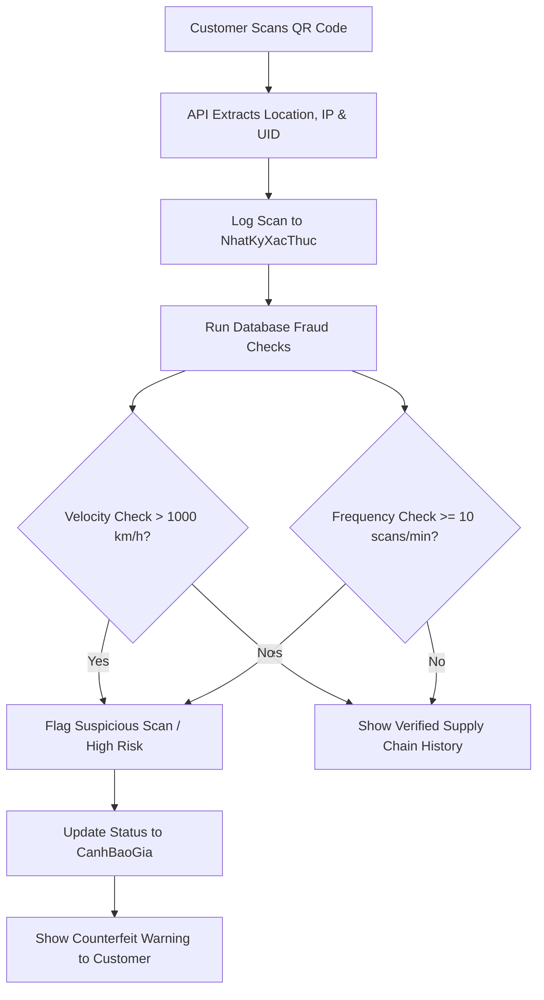
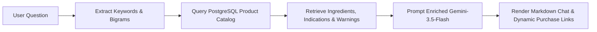

# 💊 PharmaTrace VN — Unified Fullstack Monorepo

<div align="center">
  
  <h3>An Integrated Pharmaceutical Supply Chain Transparency, WMS, and E-Commerce Platform</h3>
  <p><strong>A production-ready full-stack Monorepo orchestrating Web, API, and Database layers via Docker.</strong></p>

  
  
  
  
  
</div>

---

## 🎯 Project Vision

**PharmaTrace VN** is a modern pharmaceutical management platform built to address critical challenges in medicine sales and distribution: **counterfeit drug prevention, supply chain transparency, and automated warehouse logistics**. 

By tracking medicine packages at the unit-level with unique QR codes and cryptographic identifiers, the platform provides end-to-end transparency from the factory floor to the customer's hands.

---

## 🏗️ Repository Architecture

This repository is managed as a unified **Monorepo**, housing the frontend application, the backend API services, and database orchestration configurations in a single place.

```text
pharma-trace-vn-fullstack/
├── database/                   # Database schemas and seed data
│   └── init.sql                # Full database dump (543 sample products & schema)
├── pharmatrace-vn-backend/     # Node.js/Express 5 RESTful API
├── pharmatrace-vn-frontend/    # React 18 / Vite Client Web App
├── docker-compose.yml          # Container orchestration (Web, API, DB, Reverse Proxy)
└── .gitattributes              # Git metadata & stats configuration
```

---

## 🔍 Core Engineering Highlights

### 1. Anti-Counterfeiting & QR Traceability Engine
The crown jewel of PharmaTrace VN is its automated **Anti-Counterfeiting Engine**, which computes real-time risk profiles when a customer scans a product's QR code. Rather than just loading static text, the system executes real-time fraud algorithms directly in the database layer.



#### Technical Implementation Details
*   **Velocity Anomaly Detection (Anti-Cloning Check):** Calculates the distance between the current scan coordinate and the previous scan coordinate using the **Haversine formula** (`fn_tinh_khoang_cach_km`) combined with SQL `LAG()` window functions. If the speed between consecutive scans exceeds **1000 km/h**, it flags a location anomaly (proving the physical QR was duplicated and scanned at two distant places simultaneously).
*   **Scan Frequency Anomaly (DDoS & Scraping Check):** Uses SQL window frames (`COUNT(*) OVER (ORDER BY thoi_gian_quet RANGE BETWEEN INTERVAL '1 minute' PRECEDING AND CURRENT ROW)`) to find scan velocity spikes. Scans $\ge 10$ times/minute raise a frequency anomaly flag.
*   **Full Distribution Ledger:** Logs every custody transfer in `LichSuPhanPhoi` (e.g. *Manufactured -> Inbound -> Transferred -> Sold*) to display the medicine's full chain of custody.

### 2. Retrieval-Augmented Generation (RAG) AI Chatbot
The system features an intelligent pharmaceutical assistant powered by **Google Gemini-3.5-Flash** implementing a custom **RAG (Retrieval-Augmented Generation)** architecture to prevent AI hallucinations.



#### Technical Implementation Details
*   **Vietnamese NLP Pre-processing:** Filters out common Vietnamese stop words and extracts search tokens. It automatically builds bigrams (e.g. "đau đầu", "thiếu máu") to match compound health symptoms.
*   **Database Knowledge Retrieval:** Queries the SQL database using extracted tokens to find matching medicines, retrieving ingredients, dosages, contraindications, and warnings.
*   **Prompt Augmentation:** Structures the drug details into markdown context and appends it to the system instructions, ensuring Gemini only recommends and discusses real medicines present in the inventory.
*   **Dual-channel Payload:** Returns a natural text reply alongside structured product links (slugs, prices) so the UI can render interactive purchase cards next to the conversation bubbles.

---

## 🛍️ Portal Ecosystem

The platform features three distinct portals tailored to different user roles:

### 1. Customer Portal (E-Commerce) — `/`
*   **Browsing & Search:** High-performance product catalog with real-time fuzzy search, dynamic filters, and pagination.
*   **Shopping Experience:** Synchronization of cart state, prescription uploads for restricted medicine, and discount/voucher code validation.
*   **Account Hub:** Detailed tracking of orders, return merchandise authorization (RMA) workflows, and customer loyalty progress points.
*   **AI Chatbot Widget:** Persistent RAG AI-powered chatbot widget for pharmaceutical advice and product recommendations.

### 2. Admin Portal (ERP / Backoffice) — `/admin`
*   **Business Intelligence:** Interactive dashboard showing real-time revenue analytics, order statistics, low-stock warnings, and expiry warnings.
*   **Catalog & CMS:** Rich-text product editor, category hierarchy builder, and a built-in health blog editor.
*   **Staff Control:** Complete employee access management with Role-Based Access Control (RBAC).

### 3. Warehouse Portal (WMS) — `/warehouse`
*   **Inbound Inventory:** Scan new stock, generate unique QR identifiers, and register expiry dates.
*   **Order Fulfillment:** Unified packing pipeline to confirm, package, and ship customer orders.
*   **Stock Control:** Digital inter-shelf stock movement, structured disposal logs, and automated batch recall triggers.
*   **QR Scanner:** Camera-based HTML5 QR code scanner for swift verification.

---

## 💻 Technology Stack

| Component | Technology Used |
|---|---|
| **Frontend** | React 18, Vite, Zustand (State), Axios (API Client), Tailwind CSS (Customer UI), Ant Design v5 (Admin/Warehouse UI), Recharts |
| **Backend** | Node.js, Express 5, PostgreSQL (pg-pool), Swagger UI (docs), Google Gemini API (chatbot) |
| **Database** | PostgreSQL 15, Transactions, Row-Level Locking, Database Triggers |
| **DevOps & Infra** | Docker, Docker Compose, Nginx (Reverse Proxy & Static Web Server) |

---

## 🚀 Quick Start (Docker Compose)

The easiest way to boot the entire stack (Frontend, Backend, and Pre-seeded Database) is using Docker.

### 1. Prerequisites
Ensure you have [Docker Desktop](https://www.docker.com/products/docker-desktop/) installed and running on your system.

### 2. Start the Stack
Clone the repository and spin up the services from the root folder:

```bash
# Clone the repository
git clone https://github.com/lpgiahuy/pharma-trace-vn-fullstack.git
cd pharma-trace-vn-fullstack

# Build and start all services in the background
docker compose up --build -d
```

### 3. Access URLs
Once the services are initialized, the following ports are mapped and ready:

*   **Frontend Application:** [http://localhost](http://localhost) (Port 80)
*   **Backend REST API:** [http://localhost:3002/v1/pharmatrace](http://localhost:3002/v1/pharmatrace)
*   **Swagger API Documentation:** [http://localhost:3002/api-docs](http://localhost:3002/api-docs)

---

## 🔑 Demo Access Credentials

The database comes pre-seeded with multiple default user accounts:

| Portal | Email | Password | Role |
|---|---|---|---|
| **E-Commerce Portal** | `customer@test.com` | `password123` | Customer |
| **Admin & WMS Portal** | `admin@pharmatrace.vn` | `password123` | SuperAdmin |
| **WMS Portal Only** | `warehouse@pharmatrace.vn` | `password123` | QuanLyKho |

---

## 🛡️ Security & Performance Designs
*   **HTTP-Only Cookies:** JSON Web Tokens (JWT) are stored securely in HTTP-Only cookies to protect against Cross-Site Scripting (XSS) attacks.
*   **Row-Level Locking:** Uses PostgreSQL transactions and `SELECT ... FOR UPDATE` during checkout to prevent race conditions and ensure inventory accuracy.
*   **API Rate Limiting:** Stricter request limits on critical routes (e.g., login, checkout) to prevent brute-force and DDoS attempts.
*   **Nginx Reverse Proxy:** Nginx acts as a high-performance gateway, proxying API requests to the Node service while serving the static React build efficiently.

---

## 📄 License
This project is licensed under the MIT License - see the [LICENSE](LICENSE) file for details.
